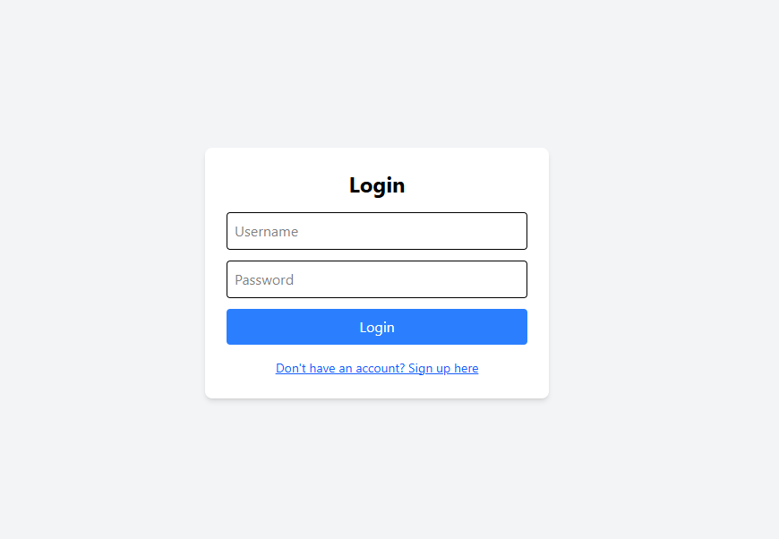
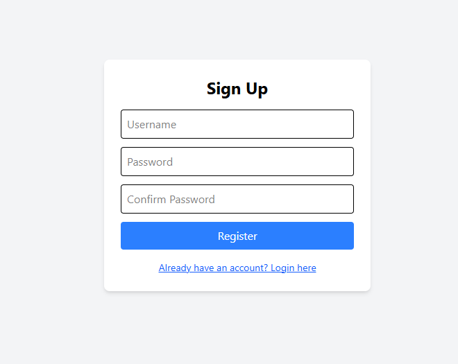

# 🔐 Auth App (React + Node.js + MongoDB)

A full-stack authentication system with separate **Login** and **Signup** pages, built using:

- **Frontend**: React (Vite), Tailwind CSS (via CDN)
- **Backend**: Node.js, Express, MongoDB (Mongoose), JWT
- **Authentication**: JSON Web Token (JWT)
- **Route Protection**: Protected React routes based on token

## 🚀 Features

- User Signup & Login
- JWT-based authentication
- Protected routes (abcWebsite)
- Logout functionality
- Tailwind UI (via CDN)

## 📦 Tech Stack

### Frontend
- React (with Vite)
- React Router
- Tailwind CSS (CDN)
- LocalStorage for token management

---

### Backend
- Node.js
- Express
- Mongoose (MongoDB)
- bcrypt (password hashing)
- jsonwebtoken (JWT)
- dotenv (environment variables)
- CORS

---

## 🛠️ Installation

### 1. Clone the Repo

```bash
git clone https://github.com/JeevithaPugazh/login-registration.git
cd login-registration
```
## Setup Backend

```bash
cd auth-app-server
npm install
```

### Create .env file:

```bash
PORT=3000
ATLAS_URI=mongodb+srv://<username>:<password>@cluster.mongodb.net/auth-app
JWT_SECRET=yourSuperSecretKey
```
### Start server:
```bash
cd auth-app-server
npm install
npm run dev

```
## Setup Frontend (Port: 5173)
```bash
cd auth-app-client
npm install
npm run dev
```
### Navigate to the app:

Login page:
👉 http://localhost:5173/login

Signup page:
👉 http://localhost:5173/signup

### Authentication behavior:

Access to /abcWebsite is restricted unless the user is logged in.

If a user attempts to visit a protected route without a valid token, they are redirected to the login page.

After login, the JWT token is securely stored in sessionStorage.

On logout, the token is cleared from storage, and the user is redirected back to the login page.